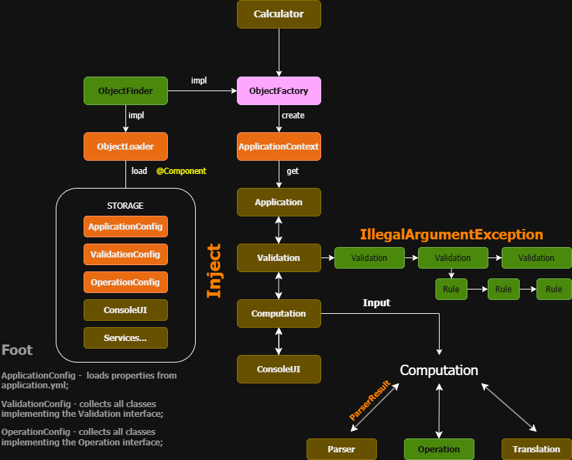

# Консольный калькулятор🚀 ___(да, еще один)___

Знакомый поделился тестовым заданием, которое ему предложили выполнить. Меня заинтересовала задача, и я решил её
сделать. С полным текстом задания можно ознакомиться [тут](assets/DESCRIPTION.md).
В процессе выполнения допускаются определенные "вольности" и полеты фантазии, так как это все такие
тестовое задание 😊
---

# Что это такое?📌

Основная идея заключалась в том, чтобы создать проект, соответствующий требованиям, но при этом обойтись без
использования фреймворков.
В процессе хотелось попробовать «изобрести» свой собственный подход и понять, с какими трудностями сталкиваются
разработчики, стремящиеся реализовать принцип IoC (Inversion of Control). Именно из этого желания и получилось то, что
получилось.

Проект был создан исключительно ради эксперимента — он не претендует на практическую ценность или дальнейшее развитие.

---

# Поговорим о географии📌

```
calculator/
├── .mvn/
│   └── wrapper/
├── src/
│   └── main/
│       └── java/
│           └── com/
│               └── eugenebay/
│                   └── calculator/
│                       └── Calculator.java
│                            └── annotation/ - Аннотации (неожиданно)
│                            └── config/     - Конфиг файлы + проперти
│                            └── context/    - Загрузчик объектов, Фабрика объектов, Хранилище объектов
│                            └── exception/  - Едем дальше...
│                            └── model/      - Tesla S
│                            └── operation/  - Вот тут интереснее - Арифметические операции* (См. *)
│                            └── service/    - Классы чтобы все завелось
│                            └── ui/         - GUI (лол консолька)
│                            └── utility/    - хлам
│                            └── validation/ - Тут тоже интересно - Валидация входной строки + Правила для арифметических операций* (См. *)
│                                   └── rule/
│                      
│                     
└── etc...

* - Можно добавлять свои реализуя соответсвующий интерфейс (Собираются автоматически в контейнер для использования) 
```

# Оно живое?📌

В целом - да! Чувствительных — прошу удалиться, а для всех остальных вот диаграмма внутренностей.


## Что за хлам тут используется 🛠️

Этот калькулятор — как старый космический тарантас: вроде едет, но скрипит. Вот что у него под капотом:

- **Maven 3.9.0+**: Потому что без этого build-комбайна пришлось бы собирать проект руками, как пещерный человек. (Gradle🔥)
- **Java 21+**: Современная, дерзкая, с кучей фич, которые всё равно не используются, но звучит круто.
- **Lombok**: Чтобы не писать геттеры-сеттеры, как стажёр, которого заставили работать сверхурочно.
- **Jackson**: JSON туда-сюда, потому что без него данные — просто каша из байтов и бла-бла....
- **JUnit**: Тесты, которые всё равно забыл написать, но давай сделаем вид, что они есть.
- **Костыли и велосипеды**: Мои изобретения, которые уже есть в стандартной библиотеке, да и в любом "большом" проекте.

Не забудь: если что-то не работает, просто удали `~/.m2` и начинай жизнь с чистого листа. 😈


---

# А что если - "Мне интересно, хочу потрогать"📌

## У тебя три "пути":

---

### 🟢 Первый:

- Клонируй репозиторий с помощью IDE (IntelliJ 🔥)
- Перейдите в src/main/java
- Нажми зеленый ⏵ треугольник напротив класса Calculator (или запусти его! чего ты?)

🔻 ___вот так он выглядит___

```java
public class Calculator {
    public static void main(String[] args) {
        final ApplicationContext context = ObjectFactory.GET.createObject(ApplicationContext.class);
        final Application app = context.getObject(Application.class);
        app.run();
    }
}
```

### 🟢 Second:

- Клонируй репозиторий.

```bash 
  git clone https://github.com/eugenebay/calculator.git
```

- Перейдите в каталог проекта.

```bash
  cd calculator
```

- Чтобы прям удивить свою девушку или парня можешь запустить. (Не обязательно! Ты и так супер!)

```bash
  ./mvnw versions:use-latest-versions -DprocessDependencies=true -DprocessPluginDependencies=true -DprocessProperties=true
```

- Запусти проект с помощью Maven.

```bash
  ./mvnw clean compile exec:java
```

### 🟢 :3

- Клонируй репозиторий.

```bash 
  git clone https://github.com/eugenebay/calculator.git
```

- Перейдите в каталог проекта.

```bash
  cd calculator
```

- Выбери своего персонажа и запусти файл в директории проекта.

| Character     | Platform   | Command           |
|---------------|------------|-------------------|
| Раб Билла     | PowerShell | `calculator`      |
| Корсар Линуса | Linux      | `./calculator.sh` |
| Бойфренд Тима | macOS      | `./calculator.sh` |

### Подготовка к полёту🚀

- Убедись, что Java у тебя вообще есть, а то без неё — как без кофе с утра: `java -version`. Если не работает, качай с
  сайта [OpenJDK](https://jdk.java.net/java-se-ri/21), не продавай душу Oracle. (если
  хочешь [продать](https://www.oracle.com/java/technologies/downloads/?er=221886#java21)😈)
- Для пингвинов и яблочников (Linux/macOS): дай скрипту право голоса, а то он молчать будет, как твой начальник на
  зарплатной встрече: `chmod +x calculator.sh`.
- Запускай всё из папки проекта, не из космоса, иначе калькулятор тебе только средний палец посчитает.

> *«Сила велика в этом калькуляторе, но терпение нужно тебе»* — запускай, вычисляй, и пусть тёмная сторона арифметики не
> соблазнит тебя!

*Сделано с 🔥 в далёкой-далёкой галактике...*